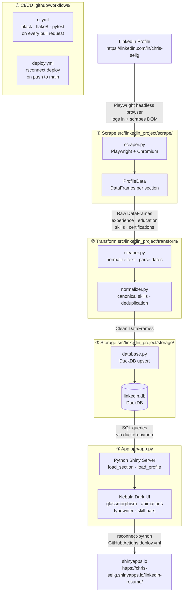

# LinkedIn Resume AI

> An end-to-end data engineering project — scrape, transform, store, and present a LinkedIn profile as an interactive web application, fully automated with CI/CD.

**Live app:** https://chris-selig.shinyapps.io/linkedin-resume/

---

## What This Project Demonstrates

This project was built to showcase a complete, production-quality data engineering workflow using modern Python tooling — from raw data collection through to a deployed web application.

| Skill Area | Technologies Used |
|---|---|
| **Data Collection** | Playwright (headless Chromium), DOM scraping, browser automation |
| **Data Engineering** | pandas (vectorized operations), data cleaning, normalization, schema design |
| **Data Storage** | DuckDB, parameterized SQL, upsert patterns |
| **Web Application** | Python Shiny, reactive UI, CSS animations, JavaScript |
| **Software Engineering** | PEP 8, type hints, docstrings, modular package design |
| **Testing** | pytest, unittest.mock, 134+ unit tests, mocked browser/DB |
| **CI/CD** | GitHub Actions, automated lint + test on PRs, auto-deploy on merge |
| **Deployment** | shinyapps.io, rsconnect-python |

---

## How It Works

The project is built as a pipeline with four distinct layers:



### ① Scrape — `src/linkedin_project/scrape/`

A headless Chromium browser (Playwright) logs in to LinkedIn and navigates to the target profile. The scraper scrolls to trigger lazy-loaded content, clicks "Show all" sections, and extracts structured data via CSS selectors. Each section (experience, education, skills, certifications) is returned as a pandas DataFrame with a typed schema defined in `schema.py`.

**Why Playwright?** The unofficial LinkedIn API requires authentication and is frequently blocked. A real browser that mimics human navigation is significantly more reliable.

### ② Transform — `src/linkedin_project/transform/`

Raw DataFrames pass through two stages:
- `cleaner.py` — strips whitespace, parses ISO 8601 dates, normalizes company names
- `normalizer.py` — maps skills to a 60+ entry canonical list, deduplicates rows, standardizes date ranges

All operations use vectorized pandas — no row-level loops.

### ③ Storage — `src/linkedin_project/storage/`

Cleaned DataFrames are upserted into a local DuckDB file (`data/duckdb/linkedin.db`). All SQL uses parameterized queries (no string interpolation). Table names are validated against an allowlist; column names in WHERE clauses are validated as alphanumeric-only to prevent injection.

**Why DuckDB?** Zero-configuration, embedded, and optimized for analytical queries on DataFrames — ideal for a local data layer that feeds a Shiny app.

### ④ App — `app/app.py`

A Python Shiny application reads from DuckDB at session start, falling back to built-in sample data if the database is absent. The UI is rendered server-side as HTML with:

- Animated gradient orb background (pure CSS)
- Glassmorphism cards with neon glow on hover
- Typewriter headline cycling through skills
- Skill bars that animate on scroll (IntersectionObserver API)
- Floating navigation dots with active section tracking

The app is self-contained in a single file to avoid import-path issues when deployed to shinyapps.io. CSS is embedded inline at startup.

### ⑤ CI/CD — `.github/workflows/`

Every pull request triggers the CI pipeline: `black --check`, `flake8`, and `pytest --cov=src`. Merging to `main` automatically deploys the app to shinyapps.io via `rsconnect-python`.

---

## Running Locally

```bash
# Setup
python3.10 -m venv .venv && source .venv/bin/activate
pip install -r requirements.txt
playwright install chromium

# Scrape your LinkedIn profile
export LINKEDIN_USERNAME="your@email.com"
export LINKEDIN_PASSWORD="yourpassword"
export LINKEDIN_PROFILE="chris-selig"
python scripts/scrape_linkedin.py

# Run the app locally
shiny run app/app.py --port 8000
```

---

## Project Structure

```
.
├── app/
│   ├── app.py                  # Shiny UI + server (self-contained)
│   └── assets/style.css        # Nebula Dark CSS
├── src/linkedin_project/
│   ├── scrape/                 # Playwright scraper + schema definitions
│   ├── transform/              # Data cleaning and normalization
│   ├── storage/                # DuckDB read/write
│   ├── pipelines/              # Pipeline orchestration
│   └── utils/                  # Shared helpers
├── scripts/
│   └── scrape_linkedin.py      # CLI entry point for scraping
├── tests/                      # 134+ unit tests (pytest)
├── deployment/
│   └── deploy.sh               # Manual deploy script (overwrites existing app)
├── .github/workflows/
│   ├── ci.yml                  # PR: lint + test
│   └── deploy.yml              # Push to main: deploy to shinyapps.io
└── docs/
    └── architecture.md         # Detailed architecture notes
```

---

## Key Engineering Decisions

| Decision | Rationale |
|---|---|
| Playwright over requests/API | LinkedIn blocks API clients; a real browser is far more reliable |
| DuckDB over SQLite/Postgres | Zero-config, columnar, native pandas integration, analytical queries |
| Inline CSS in Shiny | Static file paths differ between local and shinyapps.io — embedding guarantees consistent rendering |
| Single-file app.py | Avoids cross-directory import issues in shinyapps.io's deployment working directory |
| Parameterized SQL everywhere | Prevents SQL injection; table/column names validated against allowlists |
| Vectorized pandas only | No row-level loops — all transforms use apply/map/merge on full columns |

---

## Documentation

- [Architecture](docs/architecture.md) — detailed data flow and layer responsibilities
- [Data directory](data/README.md) — data file conventions
